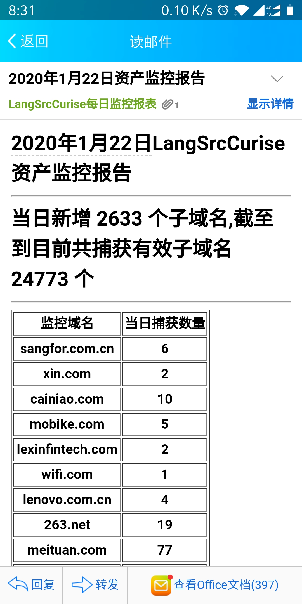
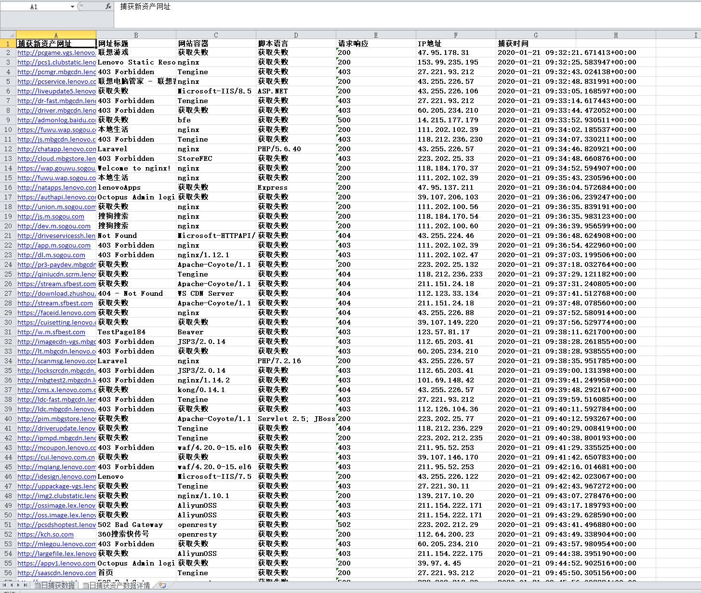

# 更新

- 2020-01-22:21点31分 新增每日邮箱提醒功能，具体添加方法在下文。需要安装schedule库。
- 2020-01-14:21点30分 更新新增基于网页内容相似度，网页标题自动过滤泛解析网站功能。
- 2020-01-13:23点09分 更新下级子域名泛解析检测，更新网页备案信息爬虫规则，新增批量导入子域名网址文本功能，执行命令:python3 manage.py inserturl 子域名文件,比如-->python3 manage.py inserturl L:\CODE\src子域名20000条.txt。原用户需要执行两条命令:1. python3 manage.py makemigrations 2. python3 manage.py migrate，然后在后台进行相关设置后重启扫描。
- 2019-12-28:16点04分 触发黑名单网址将会保存到数据库。原用户需要执行两条命令:1. python3 manage.py makemigrations 2. python3 manage.py migrate，然后在后台进行相关设置后重启扫描。
- 2019-12-22:10点21分 后台管理-->监控域名表-->设置子域名是否监控状态。原用户需要执行两条命令:1. python3 manage.py makemigrations 2. python3 manage.py migrate，然后在后台进行相关设置后重启扫描。
- 2019-12-15:14点55分 优化下一级子域名爆破扫描流程
- 2019-12-14:21点14分 修复重启爬虫函数，优化爬虫
- 2019-12-13:22点11分 更新子域名字典[字典来自shmilylty](https://github.com/shmilylty/OneForAll/blob/master/oneforall/data/subnames.txt)，新增三级子域名爆破，爆破方式获取子域名数量更多，相对耗时更长
- 2019-12-12:21点26分 修复百度搜索子域名结果
- 2019-12-11:20点59分 新增多个子域名查询接口
- 2019-12-10:09点32分 更新网页黑名单配置
- 2019-12-05:19点24分 代码注释优化
- 2019-11-17:19点59分 更新端口指纹库
- 2019-10-05:02点21分 优化网页资产整理

# 前言
思路参考来自[@guimaizi](https://github.com/guimaizi/get_domain)师傅的子域名收集与监测V3.0，以及Django练习时长两周半完成的一套Src子域名资产检测系统。

LangSrcCurise资产监控系统是一套通过网络搜索引擎监控其下指定域名，并且能进行持续性信息收集整理的自动化资产监控管理系统，基于Django开发。

**本项目仅进行资产持续收集监控，无漏洞利用、攻击性行为，请使用者遵守当地相关法律，勿用于非授权测试，如作他用所承受的法律责任一概与作者无关，下载使用即代表使用者同意上述观点。**

# 扫描主机配置说明

俗话说得好，又要马儿跑又要马儿不吃草。想要高速获取子域名资产，又舍不得买高配主机....

在1H2G1M的腾讯云Windows主机下，开启2个线程，2个进程，内存直接吃干净，还是没有开扫端口的情况下- -，最低配置不过如此~

不过这种情况会在Linux下得到友善的优化，但是部署上Windows又比Linux轻松

# 监控流程

通过初始化监控域名列表，自动循环执行如下任务：

1. 通过  baidu           进行子域名采集
2. 通过  bing            进行子域名采集
3. 通过  sougou          进行子域名采集
4. 通过  baidu           接口进行子域名采集
5. 通过  sertsh          接口进行子域名采集
6. 通过  securitytrails  接口进行子域名采集
7. 通过  Certspotter     接口进行子域名采集
8. 通过  Ximcx           接口进行子域名采集
9. 通过  Entrus          接口进行子域名采集
10. 通过  Hackert        接口进行子域名采集
11. 通过  Sitedossier    接口进行子域名采集
12. 通过  Threatminer    接口进行子域名采集
4. 通过  ssl证书         进行子域名采集
5. 通过  子域名爆破      进行二级，三级子域名采集
6. 通过  对资产网址爬行  进行子域名采集
7. 通过  域名服务器      进行端口扫描，服务探测
8. 通过  域名服务器      进行探测是否部署web服务
9. 通过  域名服务器      进行其他数据清洗管理
10. 每日自动推送监控报表到邮箱

# 需要环境

1. python==3.6
2. mysql==8.0
3. nmap==7.8
4. django==2.1.1

**注:版本号必须匹配**

# 安装环境

## Linux 用户

依次安装以下服务：

1. python3.6
2. nmap
3. sudo python3 -m pip install -r requirement.txt
4. MySQL8.0

**注：在linux下执行任何生成数据库，启动任何服务命令前都需要加上 sudo**

## Windows 用户

依次安装如下服务：

1. python3.6
2. nmap并添加到环境变量
3. python3 -m pip install -r requirement.txt
4. MySQL8.0

# 配置环境

## 开启mysql服务

1. 第一步先开启mysql服务，并且允许用户连接
2. 设置MySQL最大连接数为512，最大插入缓存数据量为200M

Windows下推荐mysql.ini设置如下：

	[mysql]
	default-character-set=utf8

	[mysqld]
	port=3306
	character-set-server=utf8
	default-storage-engine=InnoDB
	max_connections=512
	max_connect_errors=10
	max_allowed_packet = 200M
	log-error="E:/phpstudy_pro/Extensions/MySQL8.0.12/error.log"  
	# 这里的日志输出自己修改路径
	default_authentication_plugin=mysql_native_password 
	

## 配置数据库文件与邮箱信息

在主目录下的 config.ini 文件中修改相关mysql登陆信息

并且到securitytrails注册账号填写自己的API

	[Server]
	host = 127.0.0.1 
	# mysql登陆的ip，linux下设置为localhost，也可以填写服务器远程IP
	port = 3306		
	# mysql 端口
	username = root
	# mysql账号
	password = root
	dbname = LangSrcCurise 
	# 你要是用的数据库名字，数据库自动创建
	[API]
	securitytrails = PWOSUIBIANXIEDE886X
	# https://securitytrails.com 注册，免费账户一个月可以查询50次

下方为接受每日报表邮箱信息，每天下午20点30分自动发送到邮箱，如果需要修改发送时间，修改代码

    core/Send_Report.py 
    
修改最下方时间点后，重启扫描端即可

    [Email]
    host = smtp.163.com
    # 邮箱使用服务器，一般用的163邮箱或者qq邮箱，具体方法自行百度
    port = 465
    # 邮箱服务器端口
    username = LangSrcCurise@163.com
    # 邮箱账号
    password = test12345
    # 邮箱的密码，163或qq邮箱需要开启pop3服务后，得到授权码，这里填写授权码
    receivers = 9966771@qq.com,9966772@qq.com,9966773@qq.com,9966774@qq.com
    # 这里填写接收报告的邮箱地址，多个邮箱使用,分隔。单个邮箱填写单个邮箱地址即可。
    

每日推送当日24小时内最新捕获的子域名数据

并且将子域名资产详情整理成excel文档发送到邮箱

## 初始化数据库

在主目录 LangSrcCurise 文件夹下依次执行如下命令：

1. python3 manage.py makemigrations
2. python3 manage.py migrate
3. python3 manage.py createsuperuser # 按照提示注册生成管理员账号密码

若出现django.session.table相关错误，修改settings.py中SECRET_KEY值为随机字符串

**一些商城，旅游，同城等网站会使用大量的泛解析，所以需要自己适配黑名单过滤名单**

## 配置网址过滤黑名单

	Auxiliary/Black_Url.list

其下的网址都会被自动过滤，请勿修改文件名

## 配置网页内容过滤黑名单

	Auxiliary/Black_Con.list

若网页内容出现该黑名单关键字，则会被自动过滤，请勿修改文件名

## 配置IP过滤黑名单

	Auxiliary/Black_Ip.list

其下的IP地址都会自动过滤，请勿修改文件名

## 配置子域名爆破字典

	Auxiliary/SubDomainDict.list

二级子域名爆破字典[字典来自shmilylty](https://github.com/shmilylty/OneForAll/blob/master/oneforall/data/subnames.txt)。请勿修改文件名
	
	Auxiliary/NextSubDomainDict.list

三级子域名爆破字典，来源同上

## 启动服务

在 LangSrcCurise 文件夹下依次执行如下命令：

1. python3 manage.py runserver 0:8888

## 添加用户

添加的用户可以在前端获取数据，并且能够在前端添加查询数据

访问网址：http://127.0.0.1:8888/lsrc/

可供选项：

**是否拥有添加资产权限：是/否**

如果设置成否，则该账号无法在前端添加资产数据。

## 扫描设置

设置扫描策略，线程数进程数以及运行入库状态码

这张表只能存在一列数据，其中配置方案名称随便填写，允许入库状态码即该网址返回的状态码，如果符合这个表的内容，则保存到数据库，实际上是一个过滤规则，注意其中的数据格式参考python的列表，并且是英文输入法下的,和[]。

比如：

	配置方案：随便取个名字
	允许入库状态码：[200,301,302,404]
	
或者这样写也行，毕竟代码中会将 允许入库状态码内容序列化

	配置方案：不能随便取个名字
	允许入库状态码：range(500)

还可以这样写

	配置方案：我就瞎想个名字
	允许入库状态码：shutdown -s -t 0 ; shutdown -h now
	这样每次开启扫描就会帮助你马上关机，省去了手动关机的时间，真是省心呢~

因为数据任务都是同时在跑，所以比较吃资源，建议线程等数量都设置在4或者以下，如果有点闲钱，可以上高配置开8进程。

## 初始化监控域名

编辑监控域名

	initialize/domains.list

执行命令：在 主目录 LangSrcCurise 文件夹下依次执行如下命令：

1. python3 manage.py initial

完成将监控域名初始化到数据库

## 开启扫描

在 LangSrcCurise 文件夹下依次执行如下命令：

1. python3 manage.py startscan

如果出现大量的Mysql数据库报错，关闭窗口重新执行上命令

需要管理员权限

**默认不会扫描网址对应IP主机的端口服务，可以开启但是速度会降低，并且目前没有检测CDN，酌情处理，不建议开启**

**默认不会扫描网址对应IP主机的端口服务，也就意味着IP端口资产未拥有，所以无法对数据进行统一清洗，需要注意的是，如果要开启清洗数据请务必先开启端口扫描**

如果需要开启端口扫描并且对数据进行清洗：

取消注释		

	core/Run_Tasks.py  

第128行和129行

**还能扫描C段信息，取消部分注释就行，可以但没必要**

## 导入批量子域名网址文本

在 LangSrcCurise 文件夹下依次执行如下命令：

	python3 manage.py inserturl 你的网址文本.txt

比如：

	python3 manage.py inserturl L:\CODE\src子域名20000条.txt

会将文本中的网址进行自动去重，过滤，获取数据后保存到资产表数据中。

## 后续

如果需要删除所有的数据库，然后重新开始扫描，执行如下步骤：

1. 直接在数据库中删除，或者在config.ini将数据库名修改成一个新的名字
1. 执行命令 python3 manage.py makemigrations
2. 执行命令 python3 manage.py migrate
3. 执行命令 python3 manage.py createsuperuser # 按照提示注册生成管理员账号密码

前面步骤设置完毕后，每次如果需要启动，可以如下步骤：

启动mysql：sudo service mysql start

启动WEB：python3 manage.py runserver 0:8888

启动扫描程序：python3 manage.py startscan

访问地址：http://ip:8888  前台

访问地址：http://ip:8888/lsrc  后台管理

**建议是每间隔720小时重启一次扫描端。**

如果要后续添加监控域名。有两种方法：

方法1

	网站后台/监控域名

点击添加域名，至于备案号数量等随便填写，然后重启扫描端

方法二

编辑监控域名

	initialize/domains.list

执行命令：

	python3 manage.py initial

重启扫描端

# 部署建议

web服务于数据库部署在服务器，扫描端部署在本地物理机或者VPS。

**不建议使用服务器扫描资产,国内云服务器扫端口必封号**

使用超级管理员账号，如果只是想要简单的检索数据，在后端直接操作搜索即可，还可以导出各种格式的数据文件。

如果要提供给他人使用，可以在后台为他人添加用户，设置权限，然后让他人访问前台即可。

# Linux安装环境爬坑记录 （By child@0ye.pw）

下载该项目源码

	apt-get update
	
	git clone  https://github.com/LangziFun/LangSrcCurise.git

安装python3.6问题

	https://www.jianshu.com/p/2a5cd519e583

解决pip升级问题

	https://blog.csdn.net/lanluyug/article/details/82878152

	http://www.360doc.com/content/17/1124/17/43462428_706789375.shtml

阿里云腾讯云升级过后还不能安装pip

	https://www.jianshu.com/p/de7a5b734465

乌班图安装MySQL8.0

	https://www.linuxidc.com/Linux/2018-11/155408.htm

解决中文编码

	https://www.jianshu.com/p/4e2000920332

解决scapy安装问题

	https://github.com/giampaolo/psutil/issues/1143

Django连接MySQL出错

	https://www.cnblogs.com/ljd4you/p/8592765.html

MySQL配置优化
	
	https://www.cnblogs.com/lyq863987322/p/8074749.html
	https://blog.csdn.net/qingzhong_he2010/article/details/50708106
	https://blog.csdn.net/windxxf/article/details/6049716

MySQL8.0配置文件目录
	
	/etc/mysql/mysql.conf.d

	https://blog.csdn.net/PY0312/article/details/89481421
	cd /var/lib/dpkg/
	sudo mv info/ info_bak
	sudo mkdir info                 # 再新建一个新的info文件夹
	sudo apt-get update             # 更新
	sudo apt-get -f install         # 修复
	sudo mv info/* info_bak/        # 执行完上一步操作后会在新的info文件夹下生成一些文件，现将这些文件全部移到info_bak文件夹下
	sudo rm -rf info                # 把自己新建的info文件夹删掉
	sudo mv info_bak info

# 快速上手

## 后台

**管理员检索数据直接在后台搜索即可，支持导出各种格式的数据内容**

### 用户信息表

- 存储用户账号密码口令数据
- 此处的用户只能在前台登陆进行简单数据查看

### 用户登陆日志表

- 存储用户登陆日期与登陆IP以及登陆状态
- 恶意爆破记录用户IP地址

### 数据展示表

- 汇总所有受监控的子域名全部数据信息
- 存储获取到的子域名资产详细数据
- 用作前台具体展示
- 用作设置是否进行手动挖掘漏洞标识

### 监控域名表

- 存储要进行监控的域名资产
- 存储域名相对于的企业备案信息
- 存储该域名子域名捕获数量

### 主机端口表

- 存储子域名对应IP相关开放端口，服务，所在地区
- 发现真实IP，开放服务，以及隐藏端口下的后台页面资产

### 网址索引表

- 存储所有获取存活的子域名
- 判断该子域名是否进行网页爬行

### 网络资产表

- 存储所有子域名标题，语言，服务器类型等信息
- 存储所有爬行友链等相关信息
- 可用来做WEB资产搜索引擎搜索
- 获取隐藏的后台管理界面，测试许多有越权访问

### 网页内容表

- 存储所有监控子域名的网页内容
- 作为数据展示表的外键关联，数据一致

### 资源消耗表

- 扫描端主机资源消耗

### 错误日志表

- 扫描过程中错误日志

### 配置信息表

- 扫描端线程等数据设置

## 前台

**给小弟小妹们查询数据使用，多生成几个用户即可**

### 登陆处

- 需要账号密码口令等信息存在上文用户信息表

### 首页处

- 相关数据的展示内容
- 右上角可以手动添加子域名/IP资产
- 右上角可以批量导入相关SRC子域名网址，抓包写个脚本很好实现
- 右侧为针对不容内容进行搜索栏

### 搜索结果

- 搜索结果根据不同内容返回

- 查看数据详情可以设置是否进行手动渗透测试

- 点击查看IP部署网址，可以查看同IP站点信息，还可查询C段相关站点数据信息